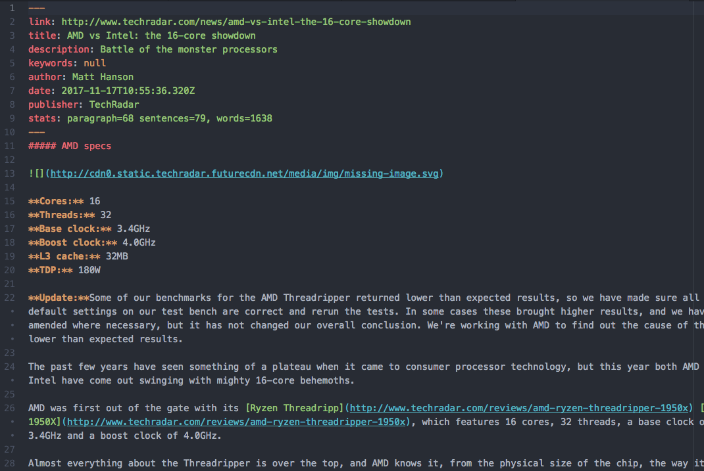

# ➹ Clean-mark

  > Convert a blog article into a clean Markdown text file.

  [![NPM Version][npm-image]][npm-url]
  [![NPM Downloads][downloads-image]][downloads-url]
  [![Build Status][build-image]][build-url]
  [![Standard Style Guide][style-image]][style-url]

## Example

For example, this article:

Is converted into this text file:

## Usage

> $ clean-mark "http://some-website.com/fancy-article"

The article will be automatically named using the URL path name. In the case, above, the name will be `fancy-article.md`.

The file type can be specified:

> $ clean-mark "http://some-website.com/fancy-article" -t html

The available types are: HTML, TEXT and Markdown.

The output file and path can be also specified:

> $ clean-mark "http://some-website.com/fancy-article" -o /tmp/article

In that case the output will be `/tmp/article.md`. The extension is added automatically.

## Installation

Simply install with npm:

> $ npm install clean-mark --global

## Why ?

* to save interesting articles offline, in a highly readable text format
* it's easy to read on a tablet, or a Kindle (as it is, or exported to PDF)
* Markdown is easy to export into different formats
* for offline text analysis of multiple articles, using machine learning / AI

## How ?

Implementation steps:

1. Downloads the content of a web page
1. Meta-scrape page details (title, author, date, etc)
1. Sanitizes the ugly HTML
1. Minifies the disinfected HTML
1. Converts the result into clean Markdown text

This project depends on the [A-Extractor project](https://github.com/croqaz/a-extractor), a database of expressions used for extracting content from blogs and articles.

## Vision

The goals of the project are are:

1. Good text extraction
1. More useless text is preferred, instead of cutting from the actual article by mistake
1. Extracting media (images, videos, audio) is not that important
1. Extraction speed is not that important

## Contributing

Clean-mark was tested on all major news sites. On some websites, the text, or links are cut from the article.
In this case, you have to manually edit the resulted text,

AND

please raise an [issue on A-Extractor](https://github.com/croqaz/a-extractor/issues) with the link that doesn't work and we'll add it in the database, so that next time, the text will be extracted correctly.

Also, see [how to contribute](CONTRIBUTING.md).

## Similar tools

* [Original readability](http://ejucovy.github.io/readability)
* [Next readability](https://github.com/luin/readability)
* [Other proiect](https://github.com/olragon/node-readability)
* [Node read](https://github.com/bndr/node-read)
* [Mozilla's readability](https://github.com/mozilla/readability)
* [Lucas Ou-Yang's Newspaper3k](https://github.com/codelucas/newspaper)
* [Mercury Parser](https://github.com/postlight/mercury-parser)

-----

## License

[MIT](LICENSE) © Cristi Constantin.

[npm-image]: https://img.shields.io/npm/v/clean-mark.svg
[npm-url]: https://www.npmjs.com/package/clean-mark
[david-image]: https://david-dm.org/croqaz/clean-mark/status.svg
[david-url]: https://david-dm.org/croqaz/clean-mark
[downloads-image]: https://img.shields.io/npm/dm/clean-mark.svg
[downloads-url]: https://npmjs.org/package/clean-mark
[build-image]: https://travis-ci.org/croqaz/clean-mark.svg?branch=master
[build-url]: https://travis-ci.org/croqaz/clean-mark
[style-image]: https://img.shields.io/badge/code_style-standard-brightgreen.svg
[style-url]: https://standardjs.com
